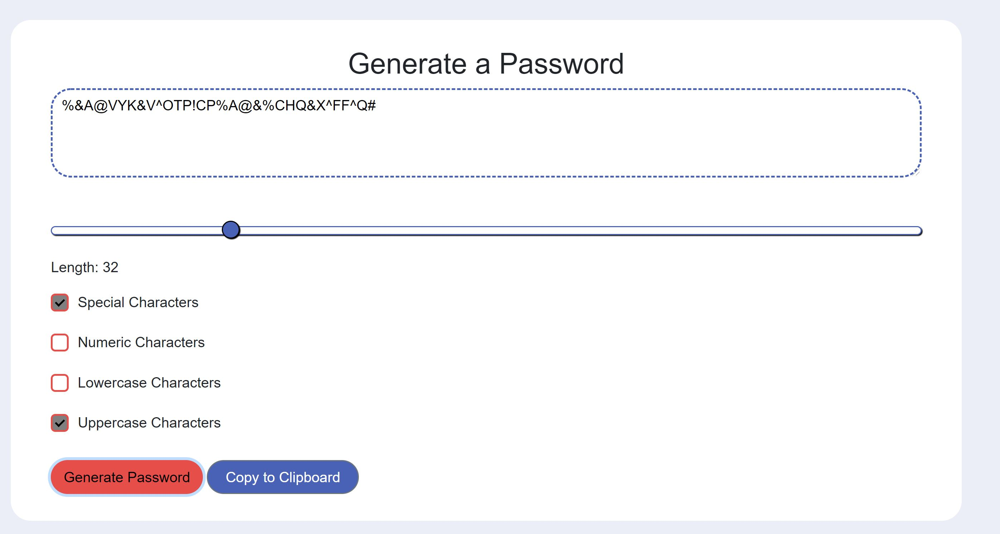

# Password Generator
## Description

The purpose of this application is to generate a secure password. 

The user can select from four different character types: Special, Numeric, Lowercase, and Uppercase. 

Additionally, the user can select the length of the password within the range of 8 to 128. 

Once the user makes their selections, they are able to click the Generate Password Button and the password will appear in the text area. They can then copy the password to their clipboard. 

You can test out the full application [here](https://alexandramj92.github.io/Unit-03-AlexandraJackson/)

## Installation

Visual Studio Code needs to be installed in order to make modifications.
I used GitHub to store my files online and create the sharable link. 

## Usage

On larger screens, the application will appear as follows. 

On smaller screens, the application is designed to be responsive with the use of some media queries. It should look something like the example below. 

The user makes the character type selection using checkboxes. Below you can see an example of all the checkboxes selected. This will generate a password with all character types.

Here is an example of when only some of the character types are selected. You can change your mind as many times as you would like. Just make new character type selections and click on the generate password button to genearate a new password with the changes you made. 

Below shows how the length selector works. It is a slider input. All you have to do is click on the circle and move it left or right. You can see how the length changes in the length field under the slider. The range is limited between 8 and 128 characters. 

I used an event listener to change the text of the "Copy to Clipboard" button to "Successfully Copied!" when clicked. Additionally, I had to add another event listener to change it back to "Copy to Clipboard" when the "Generate Password" button is clicked so that the copied notification works even if you are generating multiple passwords. 

## Credits

I would like to thank Omar for giving me the knowledge to create this password generator using html ,bootstrap, css, and javascript and the TAs for helping me work through some the issues I had with my code. 
